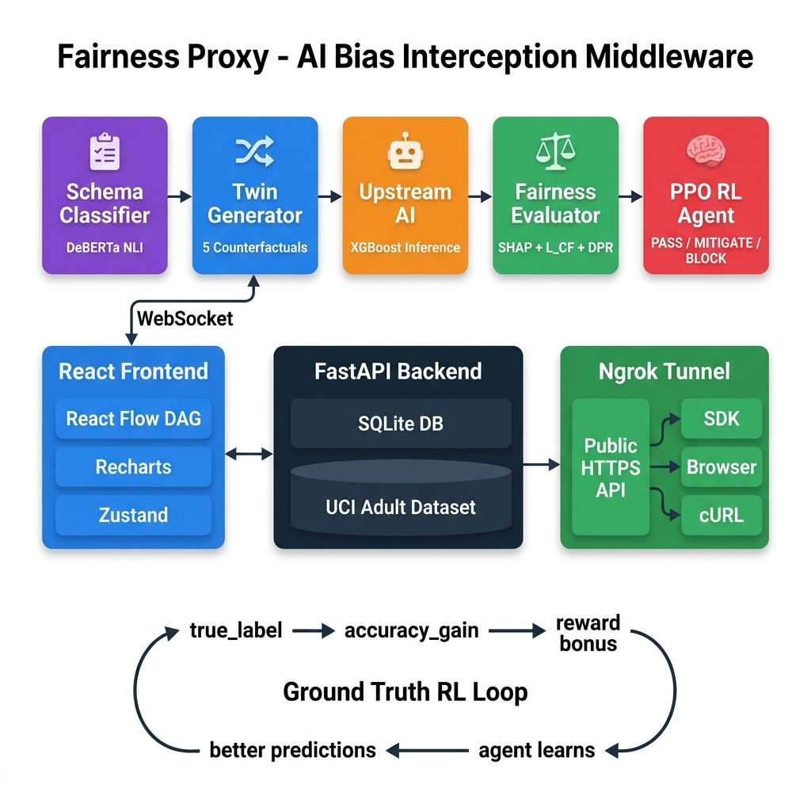

<p align="center">
  <h1 align="center">⚖️ Fairness Proxy</h1>
  <p align="center">
    <strong>AI Bias Interception Middleware — Real-Time Fairness Enforcement for Any ML API</strong>
  </p>
  <p align="center">
    <a href="#quickstart">Quickstart</a> •
    <a href="#architecture">Architecture</a> •
    <a href="#pipeline">Pipeline</a> •
    <a href="#rl-agent">RL Agent</a> •
    <a href="#api-reference">API</a> •
    <a href="#live-demo">Live Demo</a>
  </p>
</p>

---

## What is Fairness Proxy?

**Fairness Proxy** is a man-in-the-middle reverse proxy that intercepts AI decisions in real-time, detects discriminatory patterns using counterfactual analysis and SHAP explainability, and applies a **Proximal Policy Optimization (PPO) reinforcement learning agent** to mitigate bias — all before the decision reaches the end user.

> 💡 **Philosophy:** Don't fix the AI model — intercept its output and enforce fairness at the decision boundary.

---

## Architecture

<p align="center">
  
</p>

### Pipeline Flow

```
Client Request → Schema Classifier → Twin Generator → Upstream AI → Fairness Evaluator → PPO RL Agent → Fair Decision
       │              │                    │                │                │                  │              │
       │         DeBERTa NLI          5 counterfactual   XGBoost +      SHAP + L_CF +      PASS/MITIGATE    │
       │         zero-shot            permutations       biased mock    DPR analysis       /BLOCK verdict   │
       │                                                                                                     │
       └─────────────────────────── true_label (ground truth) ──────────────────────────────────────────────►│
                                    UCI Adult Dataset                     accuracy_gain → reward bonus
```

### Tech Stack

| Layer | Technology | Purpose |
|-------|-----------|---------|
| **API Server** | FastAPI + Uvicorn | Async HTTP + WebSocket |
| **ML Model** | XGBoost | Upstream AI classifier |
| **Explainability** | KernelSHAP | Feature attribution |
| **RL Agent** | PPO (PyTorch + Gymnasium) | Fairness verdict decisions |
| **NLP Classifier** | DeBERTa v3 (HuggingFace) | Zero-shot domain detection |
| **Database** | SQLite + SQLAlchemy (async) | Audit logs + RL replay buffer |
| **Dataset** | UCI Adult Income (48,842 rows) | Training + ground truth |
| **Frontend** | React + Vite | Real-time pipeline visualizer |
| **Visualization** | React Flow + Recharts | DAG canvas + accuracy charts |
| **State Management** | Zustand | Global reactive state |
| **Animations** | Framer Motion | Micro-interactions |
| **Tunnel** | Ngrok (pyngrok) | Public HTTPS API exposure |

---

## Pipeline

The proxy runs a **5-stage bias interception pipeline** on every AI decision:

### Stage 1 — Schema Classification
A DeBERTa v3 NLI model classifies the request domain (loan, hiring, healthcare) and separates features into **merit-based** (income, education) and **protected** (race, gender, age).

### Stage 2 — Counterfactual Twin Generation
Creates **5 synthetic twins** by permuting protected attributes while keeping merit features constant. If a Black female applicant is being scored, twins include White male, Asian female, etc.

### Stage 3 — Upstream Inference
Sends the original request + all 5 twins to the upstream AI model. Collects 6 decision scores. Score divergence between twins reveals bias.

### Stage 4 — Fairness Evaluation
Computes three bias metrics:
- **L_CF** — Counterfactual variance (how much scores differ across twins)
- **SHAP** — Protected feature attribution (how much race/gender influenced the score)
- **DPR** — Disparate impact ratio (statistical fairness measure)

If `true_label` is provided (from UCI Adult dataset), also computes:
- **accuracy_gain** — Did the proxy make the prediction more accurate?
- **bonus_reward** — γ × accuracy_gain added to RL reward signal

### Stage 5 — RL Agent Decision
A PPO agent observes a **7-dimensional state vector** and chooses:

| Action | Effect |
|--------|--------|
| **PASS**  | Score unchanged — no bias detected |
| **MITIGATE**  | Score adjusted to mean of twin scores |
| **BLOCK** ❌ | Score clamped to 0.5 (neutral) — severe bias |

**Reward function:**
```
R = -(α·L_CF + β·Σ|wₚ|) + γ·accuracy_gain

α = 1.0  (counterfactual variance penalty)
β = 2.0  (protected SHAP penalty)  
γ = 1.5  (accuracy improvement bonus)
```

---

## RL Agent

The agent evolves through **three training phases**:

| Phase | Episodes | Behavior |
|-------|----------|----------|
| **Heuristic Fallback** | 0–10 | Rule-based threshold decisions |
| **PPO Warming** | 10–50 | Policy network training with exploration |
| **Trained PPO** | 50+ | Full learned policy deployment |

### Ground Truth Accuracy Loop

When UCI Adult `true_label` is available, the agent receives direct feedback:

```
true_label=1.0 (high income)
original_score=0.72 → original_error = |0.72 - 1.0| = 0.28
final_score=0.85    → corrected_error = |0.85 - 1.0| = 0.15
accuracy_gain = 0.28 - 0.15 = +0.13 ← agent gets rewarded!
```

The dashboard visualizes this as a **dual-line accuracy chart** showing the Original AI flat-lining while the Fairness Proxy climbs.

---

<a id="quickstart"></a>
## Quickstart

### Prerequisites
- Python 3.10+
- Node.js 18+
- pip

### 1. Clone & install

```bash
git clone https://github.com/your-username/fairness-proxy.git
cd fairness-proxy/fairness_proxy

# Python dependencies
pip install -r requirements.txt

# Frontend dependencies
cd ui && npm install && cd ..
```

### 2. Configure environment

```bash
# .env (already pre-configured with defaults)
CORS_ORIGINS=["*"]
DATABASE_URL=sqlite+aiosqlite:///./fairness_proxy.db
NGROK_ENABLED=false          # Set true + add token for public API
NGROK_AUTHTOKEN=             # From ngrok.com/dashboard
```

### 3. Run

**Terminal 1 — Backend:**
```bash
cd fairness_proxy
python -m uvicorn app.main:app --port 8000
```

**Terminal 2 — Frontend:**
```bash
cd fairness_proxy/ui
npm run dev
```

### 4. Open

| What | URL |
|------|-----|
| **Dashboard** | http://localhost:5173 |
| **API Docs** | http://localhost:8000/docs |
| **Health Check** | http://localhost:8000/health/ |

Click **RUN PIPELINE** to process a real UCI Adult dataset row through the full bias interception pipeline.

---

## API Reference

### Core Endpoints

| Method | Endpoint | Description |
|--------|----------|-------------|
| `POST` | `/v1/proxy/infer` | Run full pipeline (HTTP) |
| `WS` | `/ws/pipeline` | Run pipeline with real-time stage streaming |
| `GET` | `/v1/dataset/next` | Fetch next UCI Adult row |
| `GET` | `/v1/audit/stats` | Audit log summary |
| `GET` | `/v1/rl/stats` | RL learning stats + accuracy curves |
| `GET` | `/v1/tunnel/info` | Current ngrok public URL |
| `GET` | `/health/` | Health check |
| `GET` | `/docs` | Swagger UI |

### Example — Run Inference

```bash
curl -X POST http://localhost:8000/v1/proxy/infer?mock=true \
  -H "Content-Type: application/json" \
  -d '{
    "target_endpoint": "/v1/decisions/infer",
    "domain": "loan_approval",
    "payload": {
      "income": 75000,
      "credit_score": 720,
      "loan_amount": 300000,
      "employment_years": 6,
      "age": 35,
      "race": "Black",
      "gender": "female"
    }
  }'
```

### Example — Python SDK

```python
from fairness_proxy import FairnessProxy

fp = FairnessProxy(
    api_key="fp_...",
    base_url="https://your-domain.ngrok-free.app"
)

result = fp.check({
    "income": 75000,
    "credit_score": 720,
    "race": "Black",
    "gender": "female"
})

print(result.verdict)        # PASS | MITIGATE | BLOCK
print(result.original_score) # 0.72
print(result.final_score)    # 0.68
print(result.accuracy_gain)  # +0.04
```

---

<a id="live-demo"></a>
## Live Demo (Ngrok)

Enable public API access for hackathon demos:

```bash
# 1. Get token from ngrok.com
# 2. Update .env
NGROK_AUTHTOKEN=your_token_here
NGROK_ENABLED=true

# 3. Start server — tunnel opens automatically
python -m uvicorn app.main:app --port 8000
```

Console will print:
```
============================================================
🚀  FAIRNESS PROXY — LIVE API
============================================================
  Public URL  :  https://xxx.ngrok-free.dev
  API Docs    :  https://xxx.ngrok-free.dev/docs
  WebSocket   :  wss://xxx.ngrok-free.dev/ws/pipeline
============================================================
```

---

## Project Structure

```
fairness_proxy/
├── app/
│   ├── main.py                    # FastAPI entry + lifespan
│   ├── api/routes/
│   │   ├── proxy.py               # POST /v1/proxy/infer
│   │   ├── stream.py              # WS  /ws/pipeline
│   │   ├── dataset.py             # GET  /v1/dataset/next
│   │   ├── audit.py               # GET  /v1/audit/stats
│   │   ├── rl_status.py           # GET  /v1/rl/stats
│   │   ├── tunnel.py              # GET  /v1/tunnel/info
│   │   └── health.py              # GET  /health/
│   ├── core/
│   │   ├── config.py              # Pydantic Settings
│   │   ├── tunnel.py              # Ngrok lifecycle
│   │   └── logging.py             # Structlog config
│   ├── db/session.py              # SQLAlchemy models
│   ├── models/schemas.py          # Request/Response schemas
│   ├── rl/ppo_agent.py            # PPO policy network
│   └── services/
│       ├── proxy_orchestrator.py  # Pipeline coordinator
│       ├── schema_classifier.py   # DeBERTa classifier
│       ├── twin_generator.py      # Counterfactual twins
│       ├── upstream_client.py     # XGBoost / mock client
│       └── fairness_evaluator.py  # SHAP + reward computation
├── scripts/
│   └── train_upstream_model.py    # XGBoost training script
├── ui/                            # React + Vite frontend
│   └── src/
│       ├── App.tsx
│       ├── components/            # Pipeline nodes + drawer
│       ├── hooks/                 # WebSocket + polling hooks
│       └── store/                 # Zustand state
├── .env                           # Environment config
├── requirements.txt               # Python dependencies
└── README.md                      # This file
```

---

## Key Metrics

| Metric | Formula | Threshold |
|--------|---------|-----------|
| **Counterfactual Variance** | L_CF = Var(twin_scores) | > 0.05 → flag |
| **Protected SHAP** | Σ\|w_protected\| | > 0.15 → BLOCK |
| **Disparate Impact** | DPR = P(ŷ=1\|protected) / P(ŷ=1\|non-protected) | < 0.8 → flag |
| **Accuracy Gain** | \|orig - true\| - \|corrected - true\| | Positive = improvement |

---

## License

MIT

---

<p align="center">
  Built for hackathon demo — proving that AI fairness can be enforced at the infrastructure layer, not just the model layer.
</p>
